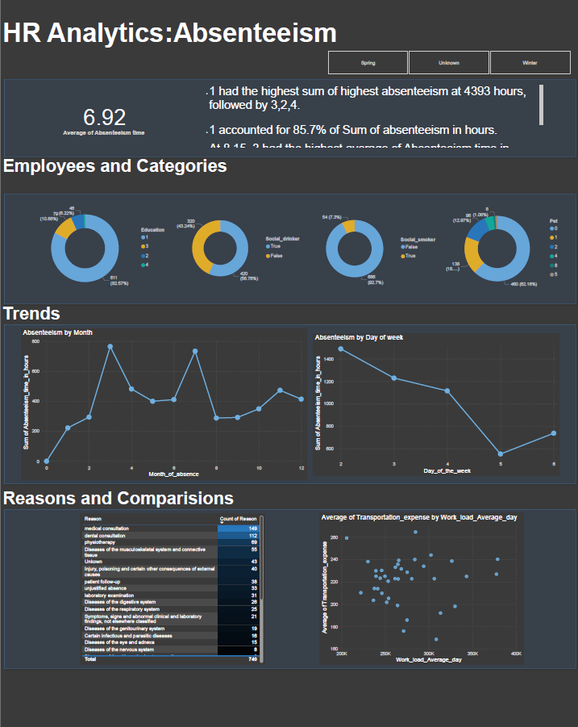

# HR Absentee Report

1.Data Extraction and Integration: Extracted HR absenteeism data from SQL database and integrated it into Power BI for analysis.  
2.Visual Analytics: Developed visualizations to identify trends and patterns in employee absenteeism, enhancing data-driven decision-making for HR management.  
2.Efficiency Improvement: Streamlined the process of monitoring absenteeism, resulting in improved accuracy and efficiency in tracking HR metrics.  

