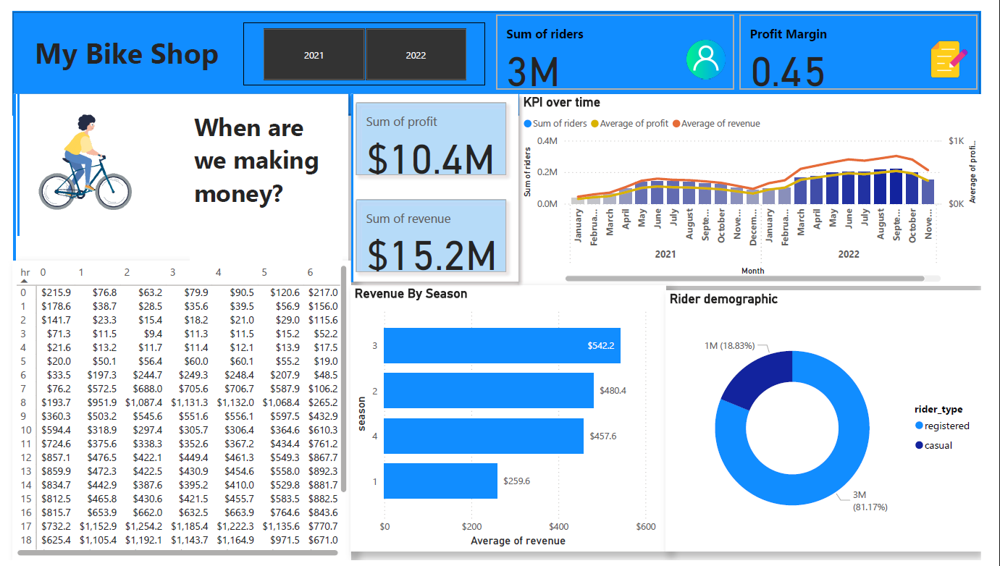

# Bike sharing company revenue analysis
1.Data Extraction and Integration: Extracted revenue and profit data of a bike-sharing company from SQL databases and integrated it into Power BI for dynamic analysis.  
2.Insightful Visualizations: Created detailed visualizations to track and analyze revenue and profit trends, supporting strategic business decisions.  
3.Performance Monitoring: Enhanced the ability to monitor financial performance, leading to more accurate and efficient revenue management and forecasting.  

